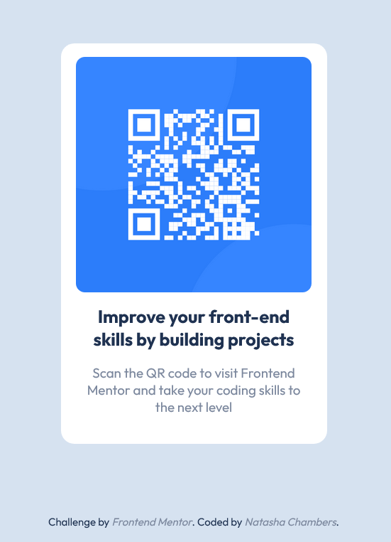

# Frontend Mentor - QR code component solution

This is a solution to the [QR code component challenge on Frontend Mentor](https://www.frontendmentor.io/challenges/qr-code-component-iux_sIO_H). Frontend Mentor challenges help you improve your coding skills by building realistic projects. 

## Table of contents

- [Overview](#overview)
  - [The challenge](#the-challenge)
  - [Screenshot](#screenshot)
  - [Links](#links)
- [My process](#my-process)
  - [Built with](#built-with)
  - [Useful resources](#useful-resources)
- [Author](#author)

## Overview

### The challenge

Your challenge is to build out this QR code component and get it looking as close to the design as possible.

You can use any tools you like to help you complete the challenge. So if you've got something you'd like to practice, feel free to give it a go.

Want some support on the challenge? [Join our community](https://www.frontendmentor.io/community) and ask questions in the **#help** channel.

### Screenshot

### Links

- Frontend Mentor Solution -> https://www.frontendmentor.io/solutions/qr-code-coTpc4c0FD
- Live Site -> https://natashaac.github.io/Challenge-QR_Code/

## My process

### Built with

- Semantic HTML5 markup
- CSS custom properties

### Useful resources

- [w3schools](https://www.w3schools.com)
- [CSS Tricks](https://css-tricks.com/)

## Author

- Website - [Natasha Chambers Portfolio](https://natashaagathachambers.com/)
- Frontend Mentor - [@NatashaAC](https://www.frontendmentor.io/profile/NatashaAC)